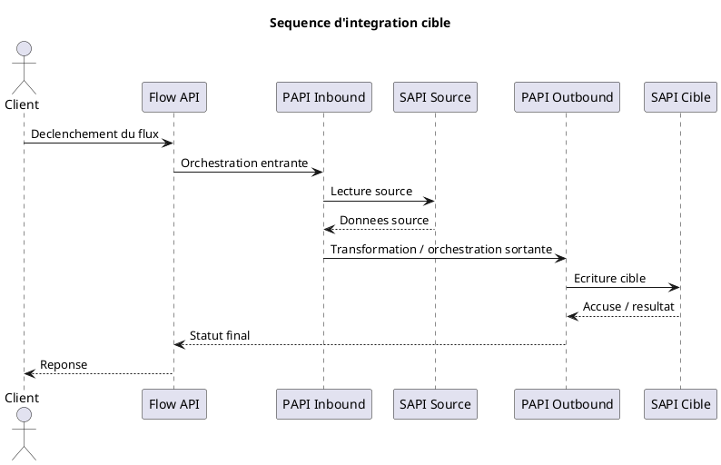

# Specification d'integration MuleSoft

## 1. Contexte et objectif

- Contexte metier :
- Objectif du flux :
- Systeme demandeur :
- Valeur attendue :
- Perimetre :
- Hors perimetre :

## 2. Synthese d'architecture cible

- Pattern retenu :
- Type d'echange :
- Declencheur :
- API-led retenu :
- Reutilisation d'APIs existantes :
- Hypotheses d'architecture :

### 2.1 Decoupage applicatif Mule

- Flow API :
- PAPI inbound :
- PAPI outbound :
- SAPI 1 :
- SAPI 2 :

## 3. Description fonctionnelle detaillee

### 3.1 Besoin fonctionnel

### 3.2 Regles de gestion

### 3.3 Cas nominaux

### 3.4 Cas alternatifs et exceptions fonctionnelles

### 3.5 Criteres d'acceptation

## 4. Description technique detaillee

### 4.1 Systeme source et systeme cible

### 4.2 Contrats d'API

Pour chaque API :
- nom ;
- role ;
- exposition ;
- URL cible ;
- version ;
- methode ;
- ressource ;
- authentification ;
- consumer attendu.

### 4.3 Endpoints et conventions

- conventions REST ;
- pluralisation ;
- versionnement ;
- correlation id ;
- headers obligatoires.

### 4.4 Sequence technique

### 4.5 Algorithme de traitement

### 4.6 Mappings et transformations

| Objet source | Champ source | Transformation | Champ cible | Regle |
| --- | --- | --- | --- | --- |
| A completer | A completer | A completer | A completer | A completer |

### 4.7 Controles et validations

### 4.8 Gestion des erreurs

- erreurs fonctionnelles ;
- erreurs techniques ;
- strategie de retry ;
- comportement en cas d'indisponibilite ;
- format de reponse d'erreur.

### 4.9 SLA, volumetrie et performance

- SLA cible :
- volumetrie nominale :
- volumetrie de pointe :
- pagination :
- timeout :
- contraintes de latence :

### 4.10 Securite

- authentification AAD ;
- client id / application ;
- scopes ;
- policies MuleSoft ;
- contrat d'API ;
- exposition publique ou privee ;
- donnees sensibles et RGPD.

### 4.11 Logging, monitoring et observabilite

- logs debug/info/warn/error ;
- donnees a ne pas logger ;
- indicateurs de supervision ;
- alerting ;
- traces de bout en bout.

## 5. Environnements et deploiement

- developpement :
- qualite :
- preproduction :
- production :
- strategie de promotion :
- dependances externes :

## 6. Versioning et gouvernance

- version d'API :
- coexistence multi version :
- prerequis de publication Exchange :
- contrats et validation :

## 7. Hypotheses et points a valider

- Hypothese 1 :
- Hypothese 2 :
- Point a valider 1 :
- Point a valider 2 :

## 8. Risques et points d'attention

- Risque 1 :
- Risque 2 :
- Attention 1 :
- Attention 2 :
